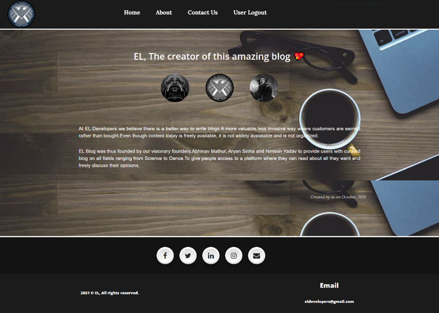

# ***EL-Blog***

EL Blog is a web app implemented using PHP, MySQL, JavaScript, HTML and CSS.
  

# Hosted

The project is deployed on () and can be viewed by clicking [HERE]()
  

# Video Link for the Project

The project walkthrough can be viewed [HERE]()
  

# Introduction
A blog is a frequently updated online personal journal or diary. It is a place to express yourself to the world. A place to share your thoughts and your passions. Really, it’s anything you want it to be. For our purposes we’ll say that a blog is your own website that you are going to update on an ongoing basis with different types of educative content.   
Blogs range from the personal to the political and can focus on one narrow subject or a whole range of subjects. It can also play an important role in student’s life. It can help in the promotion of critical and analytical thinking, increased access and exposure to quality content and a combination of solitary and social interactions with peers.  
Internet has become reality and usage of internet become very much popular and there is tremendous increase of internet in all over the world for educational purpose. The Online Blogging System is easy to use, full-featured and much more.  
The "EBLOG" has been developed to override the problems prevailing in the practicing manual system. It also provides error message while entering invalid data. No formal knowledge is needed for the user to use this system. Thus, by this all it proves it is user-friendly. Online Blogging System, as described above, can lead to error free, secure, reliable, and fast management system.
  

## SCOPE
The EBlog will allow the users to read the writings, if he/she has credentials to login, the user can like or comment on the blog. The main users of this project are students, teachers, and administrators. 
From an end-user perspective, our Eblog consists of following functional elements:   
**Dashboard:** It is the home page of the site, and we can access this option from left hand logo anytime. All links to about, contact us and admin page are available on this page.   
**Posts:**  By using the scroll button or scrolling down, we can see all the posts. We have also implemented pagination on the dataset, that means that on 1 page only 4 posts can be seen after that user has to go to next page. Posts also have the option to like, and comment provided the user is logon. Comments show the username of the person who has commented.  
**Category and Search:** The project also includes a category system by which the posts can be added to category and then the user can filter out the posts by categories. There is a search bar as well where we can search posts by their title.  
**Comments:** Posts have the option to like, and comment provided the user is logged in. Comments show the username of the person who has commented  
**Profile:** There is also the option of user login. Login is needed to comment on a post. If a user is logged in, his name will appear on the top right part of the screen.   
**Admin Tools:** There is a separate admin side to the EBlog. Admin can add posts, edit, and delete the posts. He can also view feedback which users provide through the contact us page.   
**Home Logo:** It is located at the top left portion, and we can click this logo anywhere to go back to the home page. 
  

## PURPOSE
EBlog is a perfect platform for students, teachers.  
The basic objective of developing this project is: 
* The objective of our Project is to provide all its user with easy access to relevant blogs in different fields. 
* A tool to improve the writing and digital literacy of the students.  
* To develop critical thinking skills. 
* A common platform where everyone can share their knowledge.
* Blogs are readily available always and can be used anytime to derive helpful comparisons and conclusion.
  

# Project Description
**connect.php** 
This is a simple php file made to connect our project to the database. We also import this file in other php files to help establish the connection for various sql operations.  
**about.php** 
This is the page, which details our reason for creating this page. Also gives details on the creator of this eblog from EL developers.   
**admin_home.php** 
This is the home page for the admin side. From here the admin can access all the admin function like adding and deleting a post.  
**admin.php** 
This is the page for adding posts to the blog. The admin can select a category to which the post will be added from the dropdown menu. Then add the title and content of the blog.  
**edit.php** 
This page is use for editing the posts. We are printing a table which lists all the posts below so that admin can refer the id and then edit the title and content accordingly.  
**delete.php** 
This page is use for deleting the posts. We are printing a table which lists all the posts below and a delete button is provided ahead of all the posts. On pressing the button the post gets deleted.  
**feedback.php** 
This page displays the information that a user has filled out through the contact us page. There is a table created, that displays all the information.  
**index.php** 
This is the homepage of our project. Here all the options of our webpage are visible. The user will see the search bar and the category bar first when he opens the blog. On the top there is a navbar which can be used to navigate to user login page, admin, about us page and contact us page. If a user is logged in, he will also see his name being displayed on the top-right part of the page.  
**post.php** 
This php file has been made to show the posts. The title, content, and the date on which the post was made available is displayed. Also, if the user is logged in, he can comment on the post, the name of the person who has commented is also visible.  
**countvote.php** 
On this homepage of our eblog, all the posts are visible in a short summary type format. There the users have also been given a feature to like or dislike the post. This php file keeps a count of all the likes and dislikes and displays it according to that post.  
**categ.php** 
Our eblog has a feature of filtering posts by category. When user clicks on a specific category of posts that he wants to see, he is redirected to categ.php and this php page displays all the posts of that category that the user has selected.  
**search.php** 
Through this php file, we have implemented the search bar system. The search bar is dynamic and keeps suggesting posts from the title as the user types on the bar.  
**login.php** 
This php page displays the admin login page for the admin side. There is no way to signup for the admin side, only the admins can manage the admin side and its access.  
**u_login.php** 
This php page displays the user login page for the. If the login credentials are wrong, the user will get an error otherwise he will get logged in and get redirected to the homepage. There is a signup button which will redirect him/her to signup.php incase he/she is a new user.    
**signup.php** 
This page has been made to display the signup page for new users. User will get redirected to this page if he/she presses the signup button on the user login page. User can create a new account by providing his/her credentials.  
**install.php** 
This is a simple php file for creating the database “maindb” if it does not exist already.  
**logout.php** 
This php file is used to logout for the user and admin. When the logout button is pressed, the code is redirected to this file and the session is destroyed and the user is successfully logged out.
  

# Functionalities
Database
   
Home Page
   
Post With Comments
   
Category Page
   
Admin Login
   
Admin Home
   
Edit Post
   
Add Post
   
Delete Post
   
View Feedback
   
User Login
   
User Signup
   
Contact us
   
About us
   

# Installation and Running the Project
* Download and install PHP and MySQL with Xampp
* Run Apache and MySQL on Xampp
* Store the cloned project in "`C:\xampp\htdocs`"
* Go to "`localhost/phpmyadmin`" in the web browser
* Create a new dataset with the name "`maindb`"
* Insert [THIS](database/blog.sql) SQL File in this database
* Open new Web Browser Page
* In Address Bar of the browser write "`localhost/EL_Movie-Booking-Platform/index.php`"
* You can view the Admin with "`localhost/EL_Movie-Booking-Platform/admin_home.php`"
* You can view the Dataset from "`localhost/phpmyadmin`"
  

# References
* https://dev.mysql.com/doc/
* https://developer.mozilla.org/en-US/docs/Web/JavaScript
  

# License

© Abhinav Mathur (ELLIPSIS)

Licensed under [MIT License](LICENSE).
